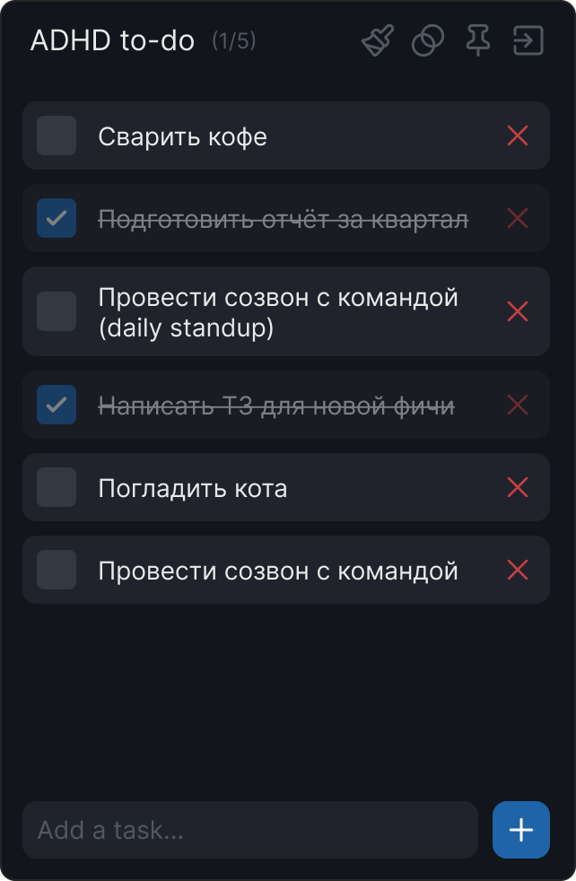

# ADHD to-do Widget

<p align="center">
  
</p>

<p align="center">
  <a href="https://github.com/hardride/TodoWidget/releases/latest">
    
  </a>
  
  
</p>

Компактный, стильный и минималистичный виджет списка задач для рабочего стола Windows, созданный для быстрого фиксирования мыслей и фокуса на главном без отвлекающих факторов.

---

## ✨ Основные возможности

- **📌 Всегда под рукой (Always on Top)**: Закрепление поверх всех окон одной кнопкой.
- **🔳 Режим плитки (32×32)**: Сворачивание в компактную плавающую плитку, которую можно переместить в любой угол экрана.
- **👁 Регулировка прозрачности**: Настройка непрозрачности от 20% до 100% со слайдером. Автоматическое приглушение при потере фокуса.
- **🎨 Темы оформления**: Syntwave (со свечением текста), Pixel-76 (с пиксель-арт фоном), Amber, Terminal (шрифт *Source Code Pro*), Kanagawa, Dark, Light, Argentina for Plemyannic.
- **🔔 Системный трей**: Быстрое сворачивание в трей, контекстное меню и восстановление по двойному клику.
- **⚡ Single Instance**: Защита от случайного запуска нескольких копий виджета.
- **💾 Сохранение данных**: Задачи и настройки темы сохраняются автоматически в `%LocalAppData%\TodoWidget\`.

---

## 🚀 Скачать и запустить

1. Перейдите на страницу **[Последнего релиза](https://github.com/hardride/TodoWidget/releases/latest)**.
2. Скачайте архив `TodoWidget-vX.X.X.zip`.
3. Распакуйте в удобную папку и запустите `TodoWidget.exe` (установка не требуется).

---

## 🛠 Управление и горячие клавиши

- **Добавление задачи**: введите текст в поле снизу и нажмите <kbd>Enter</kbd> (или кнопку `+`).
- **Завершение задачи**: клик по чекбоксу слева.
- **Удаление задачи**: клик по крестику `✕` справа.
- **Выбор темы**: кнопка с кистью 🎨 в шапке виджета.
- **Прозрачность**: кнопка с кругами 👁.
- **Закрепить поверх окон**: кнопка с булавкой 📌.
- **Свернуть в трей**: кнопка `—` справа в шапке.

---

## 💻 Сборка из исходников

Требуется установленный [.NET 9 SDK](https://dotnet.microsoft.com/download/dotnet/9.0).

```bash
# Клонировать репозиторий
git clone https://github.com/hardride/TodoWidget.git
cd TodoWidget\TodoWidget

# Сборка и запуск Debug
dotnet run

# Сборка единого exe-файла (Release)
dotnet publish -c Release -r win-x64 --self-contained true -p:PublishSingleFile=true -p:IncludeNativeLibrariesForSelfExtract=true -o ../Publish
```
